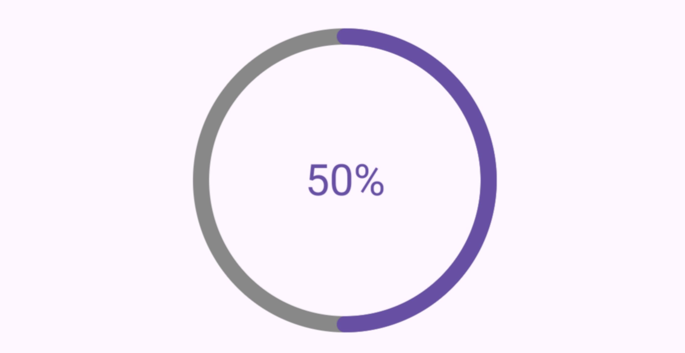
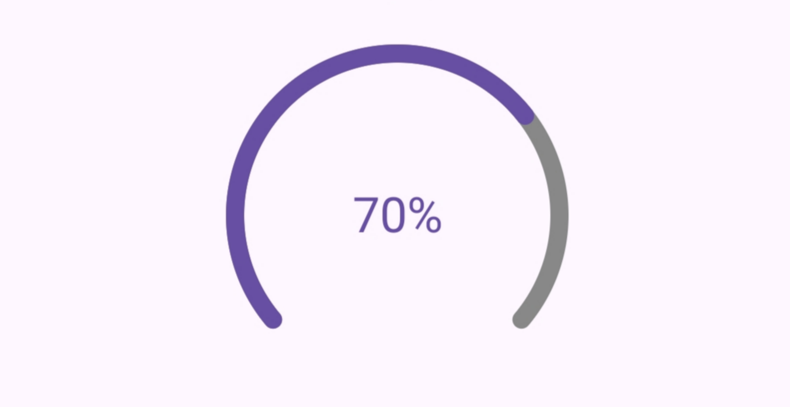

## ProgressIndicator

This is a customizable circular progress bar. You can achieve the arc progress effect with text in the center using only XML.

**Contents**

*   [Circular Progress Indicator](#circularprogressindicator)
*   [Arc Progress Indicator](#arcprogressindicator)

### Add Dependency in Gradle
[](https://jitpack.io/#ghxstbyte/progress-indicator)
```groovy
dependencies {
    implementation("com.github.ghxstbyte:progress-indicator:1.0.0")

}
```


### CircularProgressIndicator



```xml
<com.arr.arcprogressbar.CircularProgressIndicator
    android:id="@+id/progress_circular"
    android:layout_width="140dp"
    android:layout_height="140dp" />
```

### ArcProgressIndicator



```xml
<com.arr.arcprogressbar.ArcProgressIndicator
    android:id="@+id/progress_arc"
    android:layout_width="140dp"
    android:layout_height="140dp" />
```

### Common attributes
The following attributes are shared between arc progress and circular progress indicators:

|Element|Attribute|Related method(s)|Default value|
|:---:|:---:|:---:|:---:|
|Indicator color|app:colorProgress|setProgressColor|Color.BLUE
|Track color|app:colorTrack|setTrackColor|Color.GRAY
|Animation|app:arcAnimation|N/A|false
|Stroke width|app:strokeWidth|setStrokeWidth|10dp
|Text label|app:centerText|setCenterText|null
|Text color|app:centerTextColor|setTextColor|Color.BLACK
|Text size|app:textSize|setTextSize|12dp


### License 
```md
Apache License

Copyright [2024] [Alessandro Rodríguez]

   Licensed under the Apache License, Version 2.0 (the "License");
   you may not use this file except in compliance with the License.
   You may obtain a copy of the License at

       http://www.apache.org/licenses/LICENSE-2.0

   Unless required by applicable law or agreed to in writing, software
   distributed under the License is distributed on an "AS IS" BASIS,
   WITHOUT WARRANTIES OR CONDITIONS OF ANY KIND, either express or implied.
   See the License for the specific language governing permissions and
   limitations under the License.
```